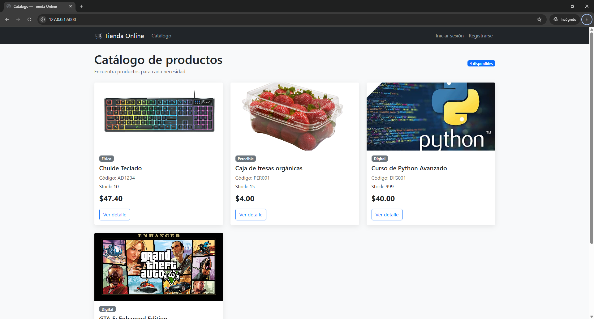
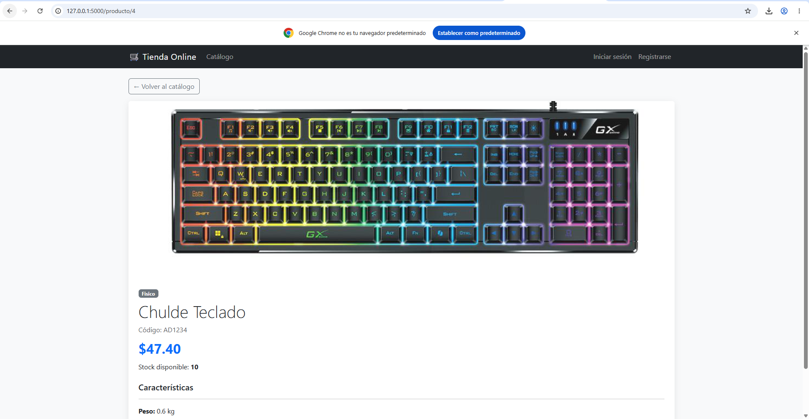
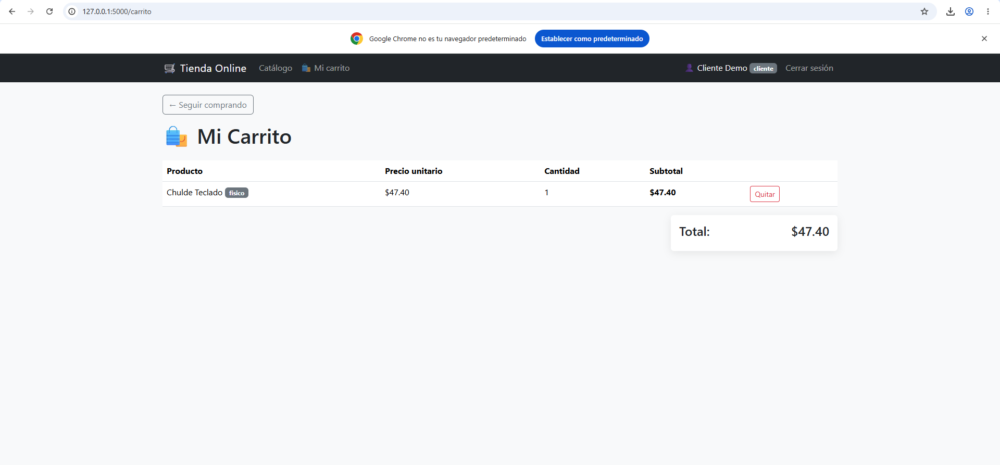

# Tienda Online

Aplicación web desarrollada con Flask y PostgreSQL para administrar un catálogo de productos físicos, digitales y perecibles. Incluye herencia y polimorfismo, CRUD, autenticación con contraseñas hash, roles, carrito de compras, subida de imágenes y diseño responsive con Bootstrap.

## Requisitos

- Python 3.11 o superior
- PostgreSQL 14 o superior
- Git

## Instalación

```powershell
git clone <URL_DEL_REPOSITORIO>
cd tienda_online
python -m venv venv
.\venv\Scripts\Activate.ps1
pip install -r requirements.txt
```

Crea una base de datos llamada `tienda_online` en PostgreSQL. Copia `.env.example` como `.env` y completa sus valores. El archivo `.env` real no debe subirse al repositorio.

Inicializa las tablas y los datos de prueba:

```powershell
python init_db.py
python app.py
```

Abre `http://127.0.0.1:5000`.

Si ya tienes una instalación de Semana 3, ejecuta una vez la migración `migrations/001_add_imagen.sql` antes de usar las imágenes.

## Credenciales de prueba

- Administrador: `admin@tienda.com` / `admin123`
- Cliente: `cliente@tienda.com` / `cliente123`

El registro público siempre crea usuarios con rol `cliente`. El panel admin solo está disponible para el usuario administrador.

## Funcionalidades

- Catálogo de productos activos con cálculo polimórfico de precio final.
- CRUD de productos protegido con `rol_requerido("admin")`.
- Login y registro con contraseñas encriptadas mediante Werkzeug.
- Carga de imágenes PNG, JPG, JPEG, GIF o WEBP de hasta 5 MB.
- Imagen por defecto para productos sin fotografía.
- Carrito por sesión con cantidades, subtotales, total y eliminación de productos.
- Alertas flash, navegación por rol y diseño responsive.

## Capturas

Las capturas de referencia están en `docs/screenshots/`:





## GitHub

El repositorio debe excluir `venv/`, `.env`, `__pycache__/`, archivos `*.pyc` y la base SQLite local. Para publicar:

```powershell
git init
git add .
git commit -m "Completa tienda online con roles, carrito e imagenes"
git branch -M main
git remote add origin <URL_DEL_REPOSITORIO>
git push -u origin main
```
